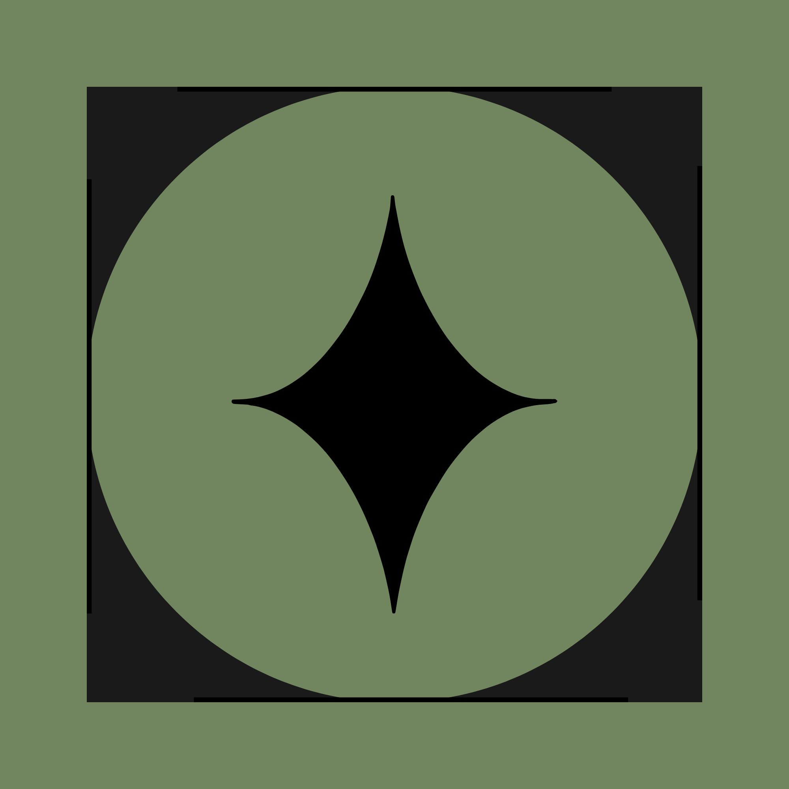

#  EasyATL

FTC AprilTag localization, simplified.

[](https://github.com/IamAki123/EasyATL/releases)
[](https://jitpack.io/#IamAki123/EasyATL)
[](https://github.com/IamAki123/EasyATL/actions/workflows/tests.yml)
[](LICENSE)

## About EasyATL

EasyATL turns FTC AprilTag detections into a filtered, field-relative robot pose. You configure the camera and tags once, tune filters from a Driver Station menu, then reuse that setup in TeleOp and auto.

It does **not** replace odometry. When `localize()` accepts a pose, you *may* correct your drive localizer. Otherwise odometry should keep tracking.

### Why EasyATL instead of raw SDK pose?

The FTC Vision SDK already gives `ftcPose` and, with camera metadata, a per-tag robot pose. EasyATL adds the pieces teams usually rewrite:

- Range / bearing / yaw filters so glancing detections do not become a pose
- Multi-tag fusion with a medoid + outlier cut (one bad tag does not yank XY)
- Per-tag weights (range, angle, optional `decisionMargin`)
- Exponential smoothing and a quality score that decays when tags are lost
- A Driver Station tuner (Pedro **or** plain FTC SDK)

It does **not** replace MegaTag botpose if you already trust that pipeline. Use [EasyATLObservations](docs/API.md#easyatlobservations) to feed Limelight *per-tag* camera-frame results into the same core.

**Expected accuracy:** measure *your* robot. With a taped lens mount, correct tag map, and tags at 3–4 ft, **1–3 in** XY and a few degrees of heading is a common good result — not a guarantee. Lighting, calibration, pitch, and field setup dominate. Error that *grows with distance* is usually pitch, lens vs housing, or calibration, not a missing filter. How to score tape vs vision: [Tuning](docs/Tuning.md#measuring-accuracy).

**Current release:** [1.2.0](https://github.com/IamAki123/EasyATL/releases/tag/1.2.0). Camera pitch, official tag maps, `DefaultSdkConstants`, the SDK tuner, and debug/uncertainty APIs. JitPack: `com.github.IamAki123:EasyATL:1.2.0`.

## First time here?

Do these in order. Each step has a longer page if you get stuck.

| Step | What you do | Details |
| --- | --- | --- |
| 1 | Add the JitPack dependency and sync Gradle | [Install](docs/Install.md) |
| 2 | Configure camera and tags | SDK: AAR defaults work (`DefaultSdkConstants` / `new FtcEasyATL()`). Copy [`EasyATLSdkConstants`](tuning/sdk/EasyATLSdkConstants.java) only to override. Pedro: copy [`EasyATLConstants`](tuning/EasyATLConstants.java) |
| 3 | Measure the **lens** (forward/right/yaw/**pitch**) and tags, or call `addCurrentGameTags()` | Filters cannot fix wrong geometry |
| 4 | Run a TeleOp that only *prints* vision pose (`APPLY_VISION_CORRECTION = false`) | [Pedro sample](docs/SampleOpMode.md) · [SDK sample](docs/SampleOpModeSdk.md) |
| 5 | When tape and vision agree, tune filters, then turn correction on | [Tuning](docs/Tuning.md) |

Pedro Pathing is required only for the Pedro copy-in tuner and sample. Core `EasyATL` / `FtcEasyATL` have no Pedro dependency. Road Runner teams should use the [SDK tuner](tuning/sdk/EasyATLSdkTuner.java).

```text
DefaultSdkConstants (AAR) or EasyATLSdkConstants / EasyATLConstants (TeamCode)
        camera, tags, Config, webcam
                │
                ▼
        tuner (practice)  →  match TeleOp / auto
                             localize(...)
```

## 1. Install

In a stock FTC SDK project, add JitPack next to `mavenCentral()` and `google()` in the **root** `build.dependencies.gradle`:

```gradle
repositories {
    mavenCentral()
    google()
    maven { url = 'https://jitpack.io' }
}
```

Then in `TeamCode/build.gradle`, inside `dependencies`:

```gradle
implementation 'com.github.IamAki123:EasyATL:1.2.0'
```

If Pedro (or other libraries) already live in `build.dependencies.gradle`’s `dependencies` block, put that `implementation` line there instead.

**Sync:** File → Sync Project with Gradle Files. Use Android Studio’s Embedded JDK for the Gradle JVM (File → Settings → Build → Gradle JDK).

Sync errors about repositories, a local source module, or JDK versions: [Install](docs/Install.md).

<a id="configure-the-robot"></a>
## 2. Configure the robot once

> ‼️ **Point TeleOp and auto at the constants file you actually use.** Copying `EasyATLSdkConstants` or `EasyATLConstants` does nothing by itself. If those OpModes still call `DefaultSdkConstants` — or you never copied a constants file — EasyATL keeps the AAR defaults (`Webcam 1`, lens at robot center, latest season). Switch the `init()` factory calls: [Tuning → Where to switch](docs/Tuning.md#where-to-switch-to-easyatlsdkconstants).

Copy [`tuning/EasyATLConstants.java`](tuning/EasyATLConstants.java) into TeamCode (package `org.firstinspires.ftc.teamcode.easyatl` if you also copy the tuner).

SDK / Road Runner teams can skip this file. `DefaultSdkConstants` (in the AAR) and `new FtcEasyATL()` already register latest-season tags, webcam `Webcam 1`, and a camera at robot center. Copy [`tuning/sdk/EasyATLSdkConstants.java`](tuning/sdk/EasyATLSdkConstants.java) only when you need different lens numbers, webcam name, or tags.

There is no separate config file. Camera, tags, pipeline `Config`, webcam, and Pedro follower belong in **the copy-in class**. `config()` is a method on it.

The copy-in file imports Super Sigma placeholders (`AprilTagWebcam`, `OFSB1.Constants`). Replace those with **your** webcam helper and Pedro `Constants.createFollower`. Keep drivetrain PID and motor names in your existing Pedro `Constants`.

Then edit the EasyATL values. The `Config` numbers below are a **sample starting point**, not library defaults (`new EasyATL.Config()` uses 96 in range and 0.65 smoothing — [API](docs/API.md)):

```java
// Lens vs robot center. Tape *your* robot. 0 yaw = pointed straight forward.
public static final double CAMERA_FORWARD_IN = 0.75;
public static final double CAMERA_RIGHT_IN = 0.25;
public static final double CAMERA_YAW_RAD = 0;
public static final double CAMERA_PITCH_RAD = 0; // negative = tilted down

public static EasyATL.Config config() {
    return new EasyATL.Config()
            .setMaxRangeInches(72)
            .setMaxBearingDegrees(55)
            .setMaxTagYawDegrees(45)
            .setOutlierDistanceInches(12)
            .setOutlierHeadingDegrees(25)
            .setSmoothingAlpha(0.70)
            .setQualityDecayRate(0.8)
            .setWeightRangeScaleInches(36);
}

public static void addTags(FtcEasyATL localizer) {
    localizer.useLatestSeason();
    // localizer.useSeason(FieldTags.Season.INTO_THE_DEEP);
    // localizer.useFieldSet(customAprilTags());
}
```

`createLocalizer(config())` builds `FtcEasyATL` from `camera()`, that `Config`, and `addTags()`. EasyATL does not open the webcam; `createWebcam` does.

### Coordinates (read once)

| Quantity | Units / convention |
| --- | --- |
| Field X/Y, camera forward/right, tag X/Y | Inches |
| Robot heading, tag facing, camera yaw | Radians, CCW-positive, `0` along field `+X` |
| Camera pitch | Radians. Positive = optical axis tilted **up**; negative = tilted **down**. `0` is level |
| Tag facing | Out of the printed face **toward the camera** |
| `CameraConfig` | The **lens**, not the housing. Negative forward = behind center; negative right = left; negative yaw = camera pointed right |
| Detection bearing and tag yaw (`ftcPose`) | Degrees (EasyATL converts as needed) |

Add every tag ID the camera might see. Default is `useLatestSeason()` (DECODE). Older games and homemade tags: [AprilTag field sets](docs/FieldTagSets.md). Unconfigured IDs are ignored. DECODE obelisk tags 21–23 are **not** for localization (they move each match).

<a id="use-in-opmode"></a>
## 3. Use it in an OpMode

Do not paste camera numbers, tags, or a new `EasyATL.Config()` into every OpMode. Call the factories from one constants class (`EasyATLConstants`, `EasyATLSdkConstants`, or `DefaultSdkConstants`).

Leave `APPLY_VISION_CORRECTION` **false** until printed vision pose matches tape. `0.20` is a sample quality gate in the sample/tuner, not a library constant. Swap `AprilTagWebcam` if `createWebcam` returns a different type.

**Imports**

```java
import com.pedropathing.follower.Follower;
import com.pedropathing.geometry.Pose;

import org.firstinspires.ftc.easyatl.FieldPose;
import org.firstinspires.ftc.easyatl.FtcEasyATL;
import org.firstinspires.ftc.teamcode.easyatl.EasyATLConstants;
import org.firstinspires.ftc.teamcode.Mechanisms.AprilTagWebcam;
```

**Fields**

```java
private static final boolean APPLY_VISION_CORRECTION = false;

private Follower follower;
private AprilTagWebcam webcam;
private FtcEasyATL localizer;
```

**`init()`**

```java
follower = EasyATLConstants.createFollower(hardwareMap);
webcam = EasyATLConstants.createWebcam(hardwareMap, telemetry);
localizer = EasyATLConstants.createLocalizer(EasyATLConstants.config());
```

**`loop()`** (after you already call `follower.update()`, or include it as shown)

```java
webcam.update();
follower.update();

boolean accepted = localizer.localize(webcam.getDetectedTags());

if (APPLY_VISION_CORRECTION && accepted && localizer.getQuality() >= 0.20) {
    FieldPose visionPose = localizer.getPose();
    follower.setPose(new Pose(visionPose.x, visionPose.y, visionPose.heading));
}
```

`accepted == true` means a new usable estimate this loop, not merely a tag on screen. Detections with `ftcPose == null` are skipped.

Drive, telemetry, and `startTeleopDrive()`: [Sample OpMode](docs/SampleOpMode.md). Constructing `FtcEasyATL` yourself: [API](docs/API.md).

**SDK / no Pedro** — [SDK sample](docs/SampleOpModeSdk.md). Import `org.firstinspires.ftc.easyatl.DefaultSdkConstants`. `init()` can use AAR defaults until you copy `EasyATLSdkConstants`:

```java
processor = DefaultSdkConstants.createProcessor();
portal = DefaultSdkConstants.createPortal(hardwareMap, processor, telemetry);
localizer = DefaultSdkConstants.createLocalizer();
```

```java
boolean accepted = localizer.localize(processor.getDetections());
```

## 4. Tune (practice, not matches)

[`EasyATLTuning`](tuning/EasyATLTuning.java) is the Pedro practice tuner (`SelectableOpMode` list). [`EasyATLSdkTuner`](tuning/sdk/EasyATLSdkTuner.java) is the same knobs with a plain D-pad menu and **no drivetrain**. Do not select either during a match.

1. Driver Station → **EasyATL Tuning** (Pedro) or **EasyATL Tuner** (SDK). **Before Play**, pick a row (D-pad up/down; Pedro also uses right to select). Start with **Vision telemetry**.
2. Press **Play**. On a filter test, D-pad **changes that one setting** (up/down = small step, left/right = large step). Change one value at a time. The SDK tuner prints per-tag OK/REJECT reasons and residual.
3. Copy the printed snippet into `config()`.

Tape the **lens** (including pitch) and tag map first. A short walkthrough of the tuner screens is in [Tuning](docs/Tuning.md); there is no separate video in this repo.

[Tuning guide](docs/Tuning.md) · [Pedro copy checklist](tuning/README.md) · [SDK copy checklist](tuning/sdk/README.md)

## Docs

| Page | When to open it |
| --- | --- |
| [Docs index](docs/DocsInfo.md) | List of all guide pages |
| [Prerequisites](docs/Prerequisites.md) | Webcam, detections, and what EasyATL does not do |
| [Install](docs/Install.md) | Gradle, JitPack, local module, JDK |
| [Sample OpMode](docs/SampleOpMode.md) | Pedro TeleOp to copy |
| [SDK sample](docs/SampleOpModeSdk.md) | VisionPortal TeleOp, no Pedro |
| [Tuning](docs/Tuning.md) | Driver Station menu, knobs, [AAR defaults](docs/Tuning.md#aar-defaults-no-constants-file), field procedure |
| [Math (simple)](docs/MathButDumbed.md) | How it works, no formulas |
| [Math](docs/Math.md) | Weights, fusion, quality, pitch |
| [AprilTag field sets](docs/FieldTagSets.md) | Latest season, old games, `customAprilTags()`, coordinates |
| [What each file does](docs/LibraryFiles.md) | `FtcEasyATL`, `DefaultSdkConstants`, `EasyATL`, `FieldPose`, `FieldTags`, `EasyATLObservations` |
| [API](docs/API.md) | Method-by-method reference |
| [Troubleshooting](docs/Troubleshooting.md) | Sync, mirrored pose, jumps, frozen pose |
| [Changelog](CHANGELOG.md) | What changed between releases |
| [Contributing](CONTRIBUTING.md) | Building this repo from source |

## Credits

Akash Vijay Aradhya — #23918 Super Sigma Robotics

AI tools (Cursor, ChatGPT, OpenAI Codex in Cursor) were used as development assistants for code generation, debugging, documentation, and refinement. Architecture, requirements, testing, validation, and final implementation decisions were directed and reviewed by the author.
